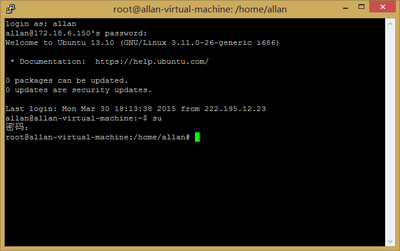
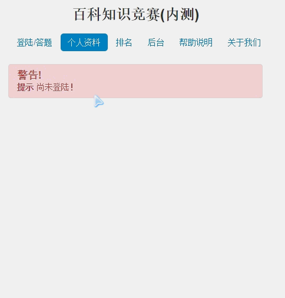
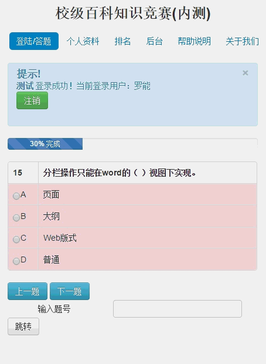
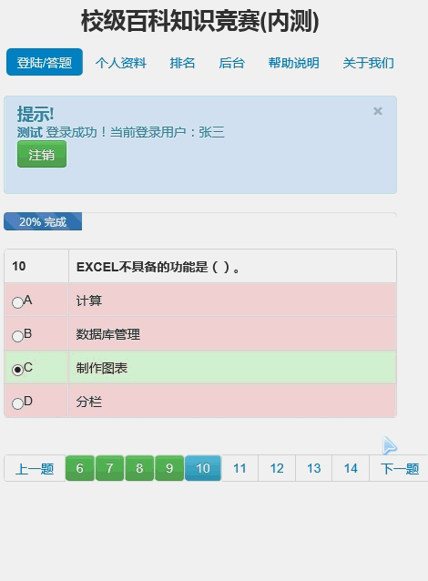
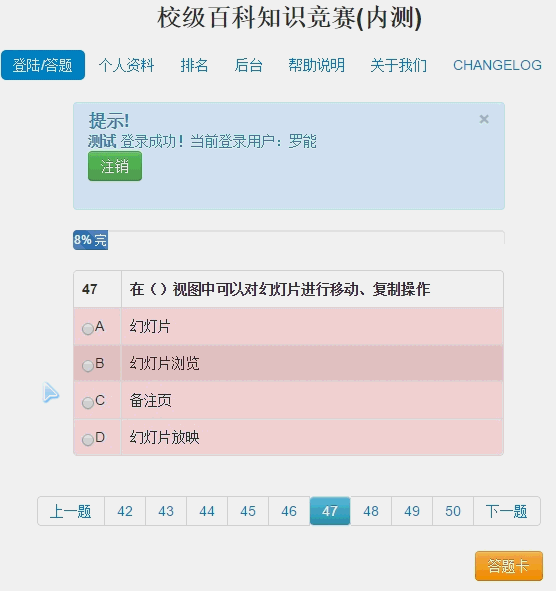
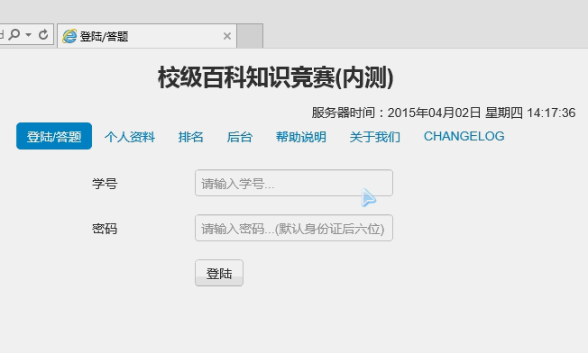
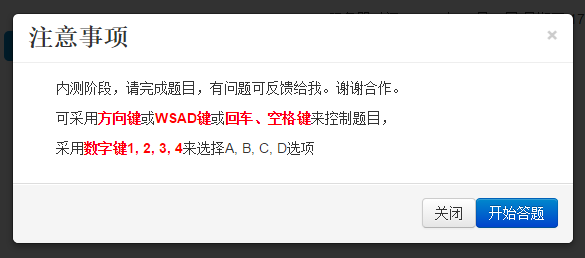
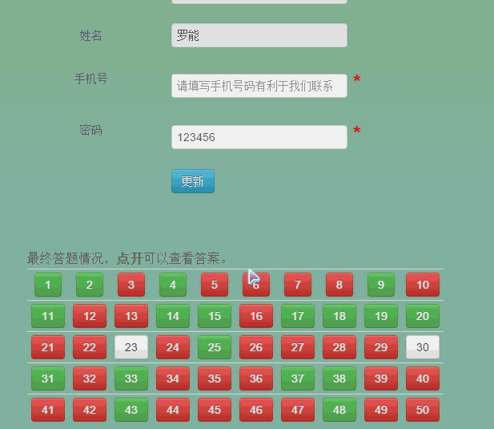

# 校级百科竞赛答题程序设计
* 策划者： Netcan
* 竞赛时间： 2015年4月8日
* 竞赛形式： 在线app答题
* 设计语言： PHP+MySQL+JavaScript+CSS+Java+Bootstrap
* 程序模块： 登陆页面，个人资料页面， 答题页面，排名页面，后台页面，关于/联系我们页面
* 注意事项： 可以采用二维码推广app，由于宣传时间和比赛时间不一致，所以海报页面应该推广app先，app地址放到外网提供下载。同时贴出题库内网地址。

// 内部细节，可补充。
## 数据导入
题库采用Excel导入，格式严格遵循如下：

题目内容|A选项|B选项|C选项|D选项|正确答案
:-:|:-:|:-:|:-:|:-:|:-:
1+1=?|2|3|4|5|A

列标签顺序可以任意互换，只要至少包含以上6个列标签（题目内容，A选项，B选项，C选项，D选项，正确答案。）

账号采用Excel导入，格式严格遵循如下：

姓名|学号
:-:|:-:
Netcan|1234567890
同上列标签顺序可互换，至少包含以上两个属性，若有邮箱数据可考虑增加发送比赛时间、比赛结果至参赛者邮箱中的功能

## 页面
1. 登陆页面，学号+密码（身份证后六位）登陆
2. 个人资料页面，收集参赛者数据，查看答题记录，不可修改
3. 答题页面，当达到指定时间即可进入，从题库中随机抽取50道题，可以考虑分5页，若比赛中出现漏题可以给出提示
4. 排名页面，在比赛结束后开放，显示参与者排名，可以采用高亮显示晋级者，（发送排名表到参赛者邮箱）。
5. 后台页面，内部人员可查看相关数据如排名，修改参赛者答题记录（指的是再给一次答题机会）
6. 关于我们页面，显示咱创协相关信息，成员介绍。

## 说明
以上是我学完PHP后在2015年4月8日为化工系创新部编写的程序，花了3天时间编写难免有bug，比赛后就没维护了。

## 程序图

